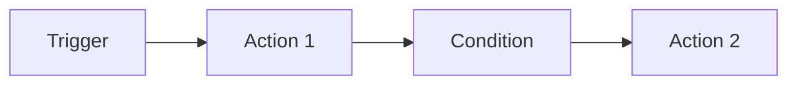
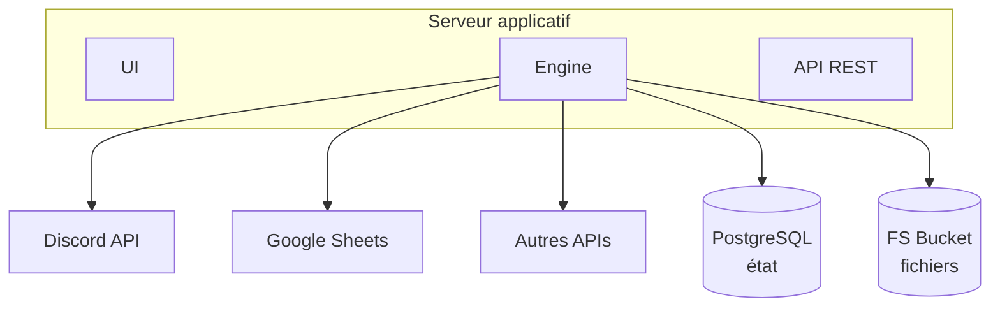

# n8n

[n8n](https://n8n.io) est une plateforme open-source d'automatisation de workflows. C'est l'équivalent de Zapier ou Make, mais auto-hébergeable et gratuit.

## Pourquoi n8n

- **Open-source** : pas de coût de licence
- **Self-hosted** : on contrôle nos données
- **Low-code** : interface visuelle, accessible aux non-devs
- **Extensible** : noeuds Code (JavaScript) pour la logique custom

## Comment ça marche

Un workflow n8n c'est une chaîne de **noeuds** connectés :

- **Trigger** : ce qui déclenche le workflow (horaire, webhook, événement...)
- **Noeud** : une opération (appel API, traitement de données, condition...)
- **Connexion** : le flux de données entre les noeuds

## Architecture technique

n8n a besoin de 3 briques pour fonctionner. Chacune a un rôle précis :

### 1. Serveur applicatif (Node.js / Bun)

Le processus principal. C'est lui qui fait tout le travail :

- **Interface web** : l'éditeur visuel de workflows, le dashboard, les logs
- **Moteur d'exécution** : lance les workflows (cron, webhook, manuellement)
- **API REST** : permet de piloter n8n en programmatique
- **Workers** : exécutent les noeuds un par un (appels API, code JS, conditions...)

C'est une app **stateless** : elle peut redémarrer sans perdre de données car tout l'état est dans la base de données.

### 2. Base de données (PostgreSQL)

Stocke **tout l'état** de n8n :

| Donnée | Exemple |
|--------|---------|
| Workflows | Noeuds, connexions, paramètres |
| Exécutions | Résultats, erreurs, timing |
| Credentials | Tokens Discord, clés API Google (chiffrés) |
| Configuration | Paramètres utilisateur, variables |

> La base tourne **24h/24** même quand aucun workflow ne s'exécute. C'est le poste de [coût](couts.md) le plus important.

### 3. Stockage fichier (FS Bucket)

Espace de stockage persistant pour :
- Clés de chiffrement (vault n8n)
- Fichiers binaires traités par les workflows

Très léger dans notre cas (< 5 Ko).

### Schéma

## Notre instance

- **Hébergement** : [Clever Cloud](clever-cloud.md)
- **Version** : n8n 2.4.6
- **Runtime** : Bun (plus rapide que Node.js classique)
- **Base de données** : PostgreSQL 17 (XXS Small Space, ~36 Mo utilisés)
- **Stockage** : FS Bucket (< 5 Ko)
- **Coûts** : voir [couts.md](couts.md)

## Ressources

- [Documentation officielle](https://docs.n8n.io)
- [Liste des noeuds disponibles](https://n8n.io/integrations)
