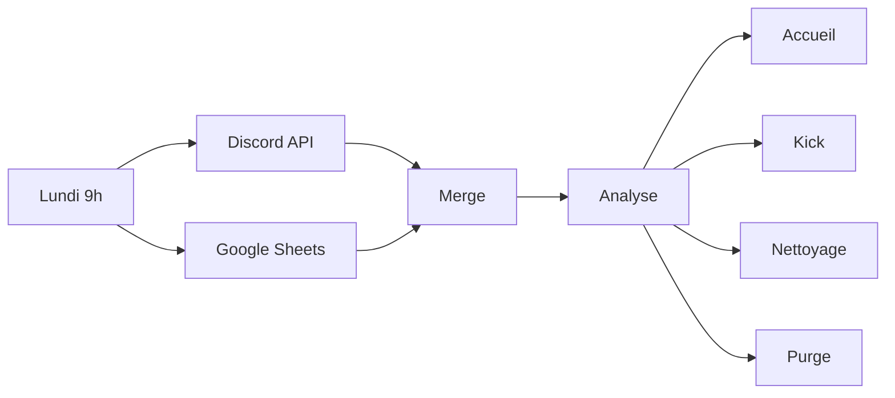

# Gestion hebdomadaire

> Automatise l'accueil, le suivi et le retrait des nouveaux membres Discord.

**Fréquence** : Chaque lundi à 9h | **29 noeuds** | **4 branches parallèles**

## Le problème

Avant ce workflow, l'accueil était 100% manuel : repérer les nouveaux, écrire un message, se souvenir de relancer, retirer les inactifs... Résultat : des oublis, des fantômes, ~30min/semaine de tâches répétitives.

## La solution

Chaque lundi à 9h, le workflow :

1. Récupère la liste des membres Discord + le tracking Google Sheets
2. Croise les deux pour identifier 4 cas
3. Agit automatiquement sur chaque cas

## Les 4 branches

| Branche | Déclencheur | Action | Détails |
|---------|------------|--------|---------|
| [Accueil](accueil.md) | Nouveau membre avec rôle "Inconnu" | Message de bienvenue + ajout au tracking | Max 20/semaine |
| [Kick](kick.md) | Date limite dépassée, toujours "Inconnu" | Retrait du serveur + marquage `kicked` | Délai 4 semaines |
| [Nettoyage](nettoyage.md) | Membre parti ou devenu actif | Marquage `parti` ou `devenu_membre` + log admin | 2 sous-cas |
| [Purge](purge.md) | Lignes archivées > 24 semaines | Suppression définitive du Sheet + log admin | Rétention expirée |

## Soft delete

Les branches Kick et Nettoyage ne suppriment plus de lignes du Sheet. Elles **marquent** les entrées avec un statut (`kicked`, `parti`, `devenu_membre`) et une date d'action. Seule la branche Purge supprime réellement les lignes, après 24 semaines de rétention. Voir [Google Sheets](../../services/google-sheets.md#soft-delete-et-rétention) pour plus de détails.

## Diagramme

> Diagramme détaillé de chaque branche dans leurs pages respectives.

## Services utilisés

- [n8n](../../infra/n8n.md) - Orchestration
- [Discord Bot](../../services/discord-bot.md) - Lecture membres, envoi messages, kick
- [Google Sheets](../../services/google-sheets.md) - Tracking des nouveaux
