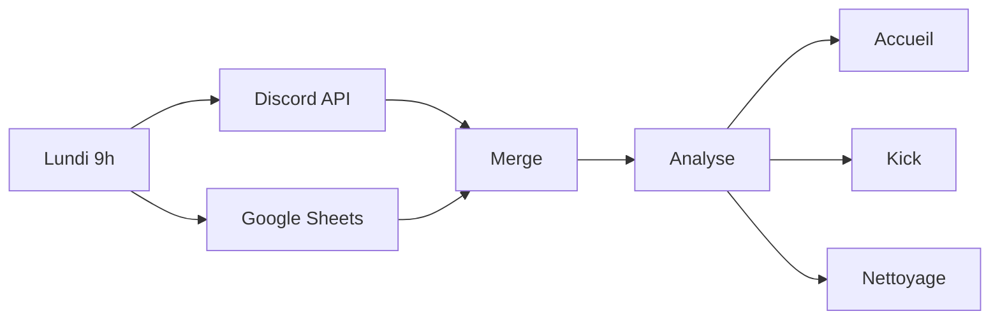

# Gestion hebdomadaire

> Automatise l'accueil, le suivi et le retrait des nouveaux membres Discord.

**Frequence** : Chaque lundi a 9h | **23 noeuds** | **3 branches paralleles**

## Le probleme

Avant ce workflow, l'accueil etait 100% manuel : reperer les nouveaux, ecrire un message, se souvenir de relancer, retirer les inactifs... Resultat : des oublis, des fantomes, ~30min/semaine de taches repetitives.

## La solution

Chaque lundi a 9h, le workflow :

1. Recupere la liste des membres Discord + le tracking Google Sheets
2. Croise les deux pour identifier 3 cas
3. Agit automatiquement sur chaque cas

## Les 3 branches

| Branche | Declencheur | Action | Details |
|---------|------------|--------|---------|
| [Accueil](accueil.md) | Nouveau membre avec role "Inconnu" | Message de bienvenue + ajout au tracking | Max 20/semaine |
| [Kick](kick.md) | Date limite depassee, toujours "Inconnu" | Retrait du serveur + log admin | Delai 4 semaines |
| [Nettoyage](nettoyage.md) | Membre parti ou devenu actif | Suppression du tracking + log admin | 2 sous-cas |

## Diagramme

> Diagramme detaille de chaque branche dans leurs pages respectives.

## Services utilises

- [n8n](../../infra/n8n.md) - Orchestration
- [Discord Bot](../../services/discord-bot.md) - Lecture membres, envoi messages, kick
- [Google Sheets](../../services/google-sheets.md) - Tracking des nouveaux
