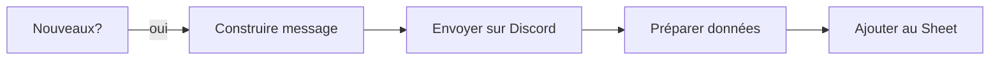

# Branche A : Accueil des nouveaux

Détecte les membres avec le rôle "Inconnu" qui n'ont pas encore été accueillis, leur envoie un message de bienvenue et les ajoute au tracking.

## Condition de déclenchement

`nombreNouveaux > 0`

Un membre est considéré "nouveau" si :
- Il a le rôle **Inconnu** sur Discord
- Il n'est **pas** dans le Google Sheet de tracking
- Il n'est **pas** un bot

## Flux

## Noeuds

### 1. Construire message (Code)

Génère un message de bienvenue **adaptatif** selon le nombre de nouveaux :

- **1 nouveau** : tutoiement ("tu es le nouveau", "ta présentation")
- **Plusieurs** : vouvoiement ("vous êtes les nouveaux", "votre présentation")

Le message contient :
- Mention(s) des nouveaux (`@user`)
- Explication du rôle "Inconnu" et des étapes pour devenir "Futur-membre"
- Les 2 étapes : présentation dans le channel dédié **ET** formulaire Google
- La date limite (4 semaines)
- Liens réseaux sociaux de l'association

### 2. Envoyer message (Discord)

Poste le message dans le channel **#présentations**.

### 3. Préparer données sheet (Code)

Formate chaque nouveau en ligne de spreadsheet :
- `userId`, `username` (username Discord réel), `dateAccueil` (aujourd'hui), `dateLimite` (+28 jours), `statut` (`actif`), `dateAction` (= dateAccueil)

### 4. Ajouter au Sheet (Google Sheets - Append)

Insère les lignes dans le [Sheet de tracking](../../services/google-sheets.md) avec le statut `actif`.

## Garde-fou

- **Max 20 nouveaux par semaine** : si plus de 20 arrivent, les suivants sont reportés à la semaine d'après (triés par date d'arrivée, les plus anciens d'abord). Cette limite évite de surcharger le channel **#présentations** avec un mur de mentions, et reste cohérente avec le rythme réel de l'association (~5-15 nouveaux/semaine en période de recrutement).
