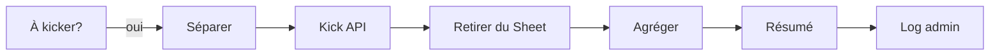

# Branche B : Kick des membres expirés

Retire du serveur les membres qui n'ont pas complété les étapes dans le délai imparti.

## Condition de déclenchement

`nombreAKick > 0`

Un membre est "à kicker" si :
- Il est dans le Google Sheet (donc déjà accueilli)
- Sa `dateLimite` est dépassée
- Il a **toujours** le rôle "Inconnu" (n'a pas fait les étapes)

## Flux



## Noeuds

### 1. Séparer membres (Code)

Éclate la liste en items individuels (un par membre) pour traitement séquentiel.

### 2. Kick (HTTP DELETE)

Appel API Discord : `DELETE /guilds/{guild_id}/members/{user_id}`

- **Batching** : 1 requête toutes les 1.5 secondes
- Le membre est retiré du serveur (il peut re-rejoindre via lien d'invitation)

> Le batching est crucial : l'API Discord a des [rate limits](../../services/discord-bot.md#rate-limits) stricts. Sans délai, on reçoit une erreur `429 Too Many Requests`.

### 3. Retirer du Sheet (Google Sheets - Delete)

Supprime la ligne du tracking.

### 4. Agréger + Résumé + Log

Regroupe les résultats, construit un message récapitulatif et l'envoie dans le channel **#log-cellacom** (privé, réservé aux admins) :

```
⚠️ 3 membre(s) retiré(s) du serveur (date limite dépassée) :
• User1 (date limite : 2025-01-15)
• User2 (date limite : 2025-01-15)
```

## Note importante

Le membre n'est **pas** prévenu par DM avant le kick. Il a été informé de la date limite dans le message de bienvenue public.
