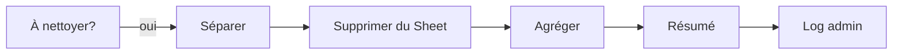

# Branche C : Nettoyage du tracking

Supprime du Google Sheet les entrées qui n'ont plus lieu d'être suivies.

## Condition de déclenchement

`nombreANettoyer > 0`

## Deux sous-cas

| Cas | Détection | Signification |
|-----|-----------|---------------|
| **Parti** | Dans le Sheet mais plus sur le serveur Discord | Le membre a quitté de lui-même |
| **Devenu membre** | Dans le Sheet, sur le serveur, mais n'a plus le rôle "Inconnu" | Il a fait les étapes, un admin lui a attribué un nouveau rôle |

## Flux



## Noeuds

### 1. Séparer à nettoyer (Code)

Éclate la liste en items individuels.

### 2. Supprimer du Sheet (Google Sheets - Delete)

Retire l'entrée du tracking (dans les deux cas, le suivi n'est plus nécessaire).

### 3. Agréger + Résumé + Log

Le message de log **distingue les deux raisons** pour donner de la visibilité aux admins :

```
🧹 Nettoyage du tracking :

2 membre(s) parti(s) d'eux-mêmes :
  • User1
  • User2

1 membre(s) devenu(s) Futur-membre :
  • User3
```

Envoyé dans le channel **#log-cellacom** (même channel que les logs de kick).
