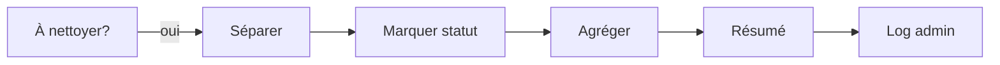

# Branche C : Nettoyage du tracking

Marque dans le Google Sheet les entrées qui n'ont plus lieu d'être suivies activement.

## Condition de déclenchement

`nombreANettoyer > 0`

## Deux sous-cas

| Cas | Détection | Statut appliqué |
|-----|-----------|-----------------|
| **Parti** | Dans le Sheet (actif) mais plus sur le serveur Discord | `parti` |
| **Devenu membre** | Dans le Sheet (actif), sur le serveur, mais n'a plus le rôle "Inconnu" | `devenu_membre` |

## Flux



## Noeuds

### 1. Séparer à nettoyer (Code)

Éclate la liste en items individuels. Chaque item contient le `userId` et la `raison` (`parti` ou `devenu_membre`).

### 2. Marquer statut dans Sheet (Google Sheets - Update)

Met à jour la ligne du membre (identifié par `userId`) :
- `statut` → la raison (`parti` ou `devenu_membre`)
- `dateAction` → date du jour

La ligne n'est **pas supprimée** : elle reste dans le Sheet pour traçabilité pendant 24 semaines, puis est [purgée](purge.md) automatiquement.

### 3. Agréger + Résumé + Log

Le message de log **distingue les deux raisons** pour donner de la visibilité aux admins :

```
🧹 Nettoyage du tracking :

2 membre(s) parti(s) d'eux-mêmes :
  • User1
  • User2

1 membre(s) devenu(s) Futur-membre :
  • User3
```

Envoyé dans le channel **#log-cellacom** (même channel que les logs de kick).
