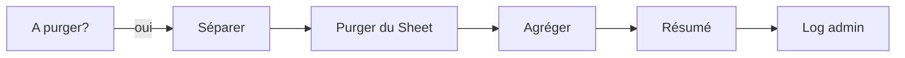

# Branche D : Purge des lignes archivées

Supprime définitivement du Google Sheet les lignes dont la période de rétention de 24 semaines est expirée.

## Condition de déclenchement

`nombreAPurger > 0`

Une ligne est "à purger" si :
- Son `statut` n'est **pas** `actif` (c'est-à-dire `kicked`, `parti`, ou `devenu_membre`)
- Sa `dateAction` remonte à **plus de 24 semaines**

## Flux



## Noeuds

### 1. Séparer à purger (Code)

Éclate la liste en items individuels. Les lignes sont triées par **numéro de ligne décroissant** pour garantir que les suppressions ne décalent pas les indices des lignes suivantes.

### 2. Purger du Sheet (Google Sheets - Delete)

Supprime la ligne par `row_number`. C'est la **seule branche du workflow qui supprime** réellement des lignes du Sheet.

> La suppression par `row_number` est sûre ici car cette branche est la seule à effectuer des suppressions, et les lignes sont traitées de bas en haut (desc). Les branches Kick et Nettoyage utilisent des `update` par `userId`, qui ne modifient pas les positions des lignes.

### 3. Agréger + Résumé + Log

Construit un message récapitulatif et l'envoie dans le channel **#log-cellacom** :

```
🗑️ 5 ligne(s) purgée(s) du tracking (rétention 24 semaines expirée) :
• User1 (kicked, archivé le 2025-08-15)
• User2 (parti, archivé le 2025-08-10)
```

## Pourquoi 24 semaines

La période de rétention permet :
- De garder un historique suffisant pour les admins (~6 mois)
- D'éviter que le Sheet ne grossisse indéfiniment
- De laisser le temps de corriger des erreurs éventuelles de marquage
